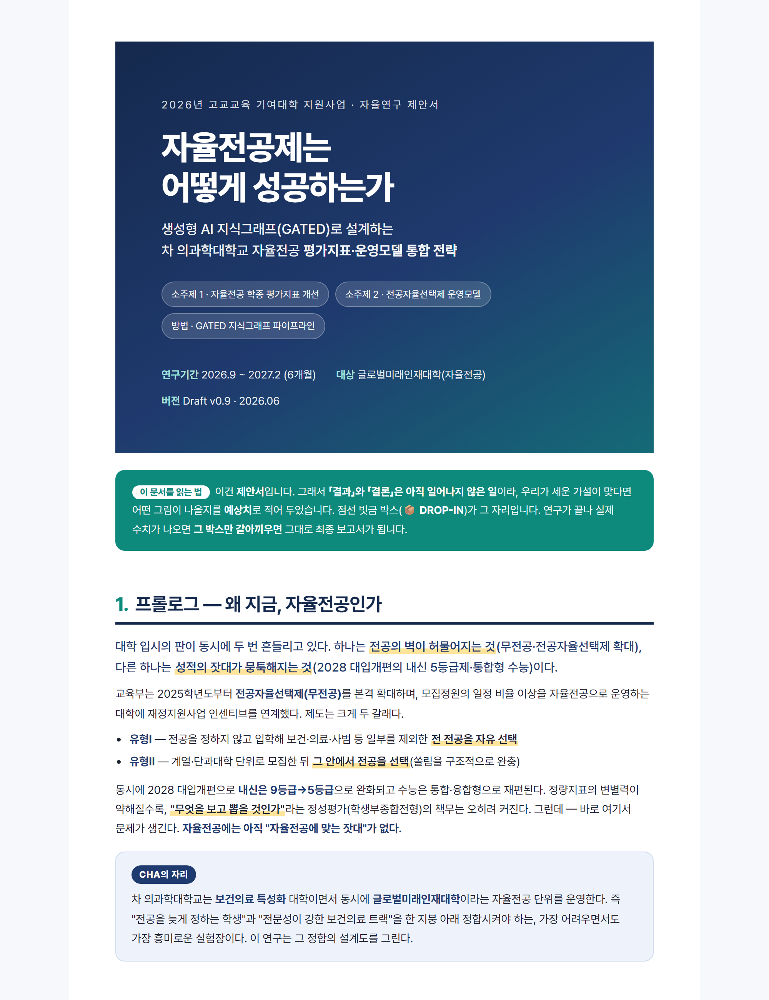

# 자율전공제는 어떻게 성공하는가 — GATED 기반 통합 전략 연구제안서

> 2026년 고교교육 기여대학 지원사업 · 자율연구 제안서 (Draft)
> 생성형 AI 지식그래프(**GATED**)로 설계하는 차 의과학대학교 자율전공 **평가지표·운영모델 통합 전략**

## 개요
- **소주제 1** — 자율전공(글로벌미래인재대학) 학생부종합전형 서류·면접 **평가지표 개선**
- **소주제 2** — 전공자율선택제(유형Ⅰ·Ⅱ) **운영모델** 타대학 사례 연구 및 CHA 적용
- **방법** — 뉴스·논문을 대량 수집 → GPT 관련성 필터링 → 인과 **지식그래프(KG)** 구축 → **GATED**(Graph-Aware Transformer with Encoder-Decoder) 추론

## 구조 (보고서 드래프트)
문제정의 → 연구가설 → 선행연구·한계 → 전략(GATED) → 검증설계 → **(예상)결과** → 가치·향후 → 참고문헌

> 제안서이므로 **결과·결론은 예상치**(📦 DROP-IN 박스)로 기재했으며, 실제 분석 결과가 나오면 해당 박스만 교체하면 최종 보고서가 된다.

## 산출물
- [`index.html`](index.html) — 웹 보고서 (GitHub Pages로 공개)
- [`자율전공_GATED_연구제안서.pdf`](자율전공_GATED_연구제안서.pdf) — 인쇄용 PDF (A4)
- [`render.py`](render.py) — HTML → PDF/썸네일 렌더링 스크립트 (Playwright)

## 방법론 출처
본 파이프라인은 mAb 안정성 인과 지식그래프 연구(**mAb-GATED**, ISMB 2026 채택)와 생성형 AI–인간 협업 메타분석 절차에서 이식했다.
